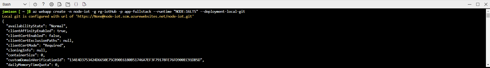
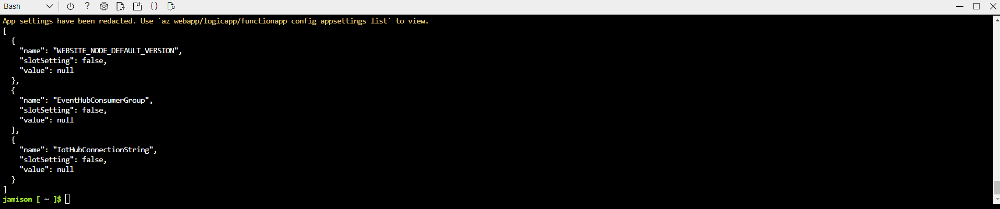
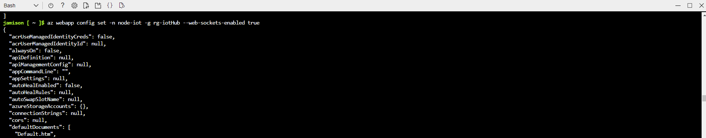
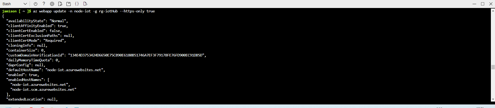
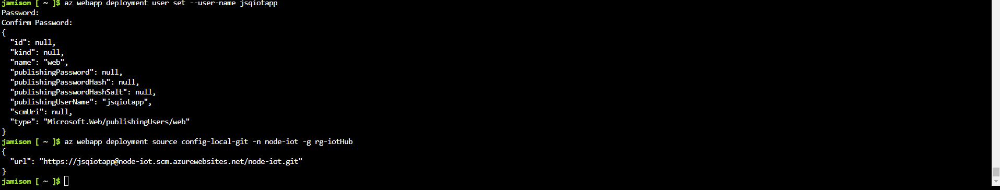
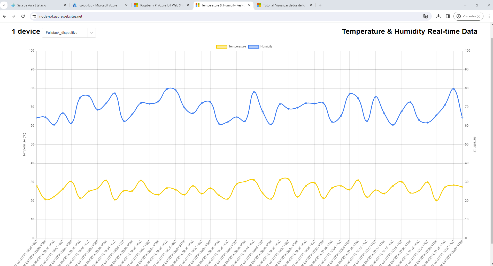

## Projeto IoT na Azure 

Desenvolvimento de um projeto de visualização em tempo real de dados provenientes de sensores conectados ao Azure IoT Hub, utilizando uma aplicação Node.js.

## Recursos

- Conta no Microsoft Azure.
- Navegador Web (Google Chrome, Firefox, MS Edge, Safari ou Opera).
- Visual Studio Code (VS Code).
- Raspberry Pi Azure IoT Online Simulator.
- Aplicativo Web do GitHub, disponível em https://github.com/Azure-Samples/web-apps-node-iot-hub-data-visualization
- Auxílio : https://learn.microsoft.com/pt-br/azure/iot-hub/iot-hub-live-data-visualization-in-web-apps

## Configuração Inicial
Baixei os fontes do aplicativo base, e acessei a conta do Azure para fazer as configurações necessárias, começando pela criação de um grupo de consumidores vinculado ao Hub IoT.

## Simulador Raspberry Pi
Habilitei o simulador do Raspberry.

## Aplicação local
Com tudo configurado adequadamente eu iniciei a aplicação Node.js Local.

## Saída no Console Local

##  Criando Plano de Serviço
Comecei a configurar a hospedagem da aplicação no Azure, iniciando com a criação de um plano de serviço.

##  Criando WebApp

##  Configurando o WebApp

##  Habilitando WebSocket

##  Habilitando HTTPS

##  Habilitando Acesso ao WebApp via Git

## Aplicação no Azure
Com tudo configurado adequadamente eu acessei o link da aplicação hospedada no Azure.

